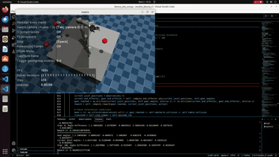

# Obstacle-Aware Reinforcement Learning with Kinova Gen3



This branch extends the basic joint-space reaching task by introducing **obstacle awareness**
and **collision avoidance** in a MuJoCo simulation of a Kinova Gen3 (7-DOF) robot.

The focus is still **state-based RL** (no vision/perception integration). The agent learns to reach
randomly sampled goals while avoiding collisions with obstacles and the table.

---

## Overview

- **Robot:** Kinova Gen3 (7-DOF)
- **Simulator:** MuJoCo (Gymnasium `MujocoEnv`)
- **RL Algorithm:** PPO (Stable-Baselines3)
- **Task:** reach randomly sampled goals while avoiding collisions
- **Obstacles:** 4 spheres randomly placed in the workspace (with a minimum distance from the base)
- **Safety events:** obstacle collision + table collision terminate an episode

---

## Task Design

### Observation Space (76D)
Compared to Level 1 (21D), the observation is expanded to include obstacle and safety information:

- Joint positions (7)
- Joint velocities (7)
- Joint error to goal angles (7)
- Obstacle sphere positions (4 × 3 = 12)
- Minimum distance to each obstacle (4)
- Collision flags per obstacle (4)
- Global obstacle collision flag (1)
- Table collision flag (1)
- Delta link-to-obstacle distances (4 obstacles × 8 robot parts = 32)
- Distance-to-goal in Cartesian space (1)

(See implementation in `kinova_obs_env.py`.) 

---

## Collision & Distance Logic

To approximate collision risk, the environment computes Euclidean distances between:
- **8 robot points/parts** (computed via FK helper, casadi (see c_func.py)), and
- **each of the 4 obstacle spheres**

This produces a (4 × 8) distance table each step. A collision is flagged if the minimum distance
between any robot part and an obstacle drops below a threshold. Table collision is checked by
ensuring robot points do not fall too close to the table height.

A key addition is the **delta distance** term:

> `delta = current_link_distances - previous_link_distances`

If `delta < 0`, that link moved **closer** to the obstacle in the last step.

---

## Reward Function (High-Level)

The reward trades off three objectives:

1. **Reach the goal**
2. **Avoid collisions**
3. **Encourage smooth actions**

Key behaviors:
- Large negative reward and termination on obstacle collision
- Large negative reward and termination on table collision
- Positive reward when goal is reached
- Continuous shaping from joint-space error and Cartesian distance-to-goal
- Additional penalty when the robot moves closer to obstacles (negative delta distances)

---

## Demo Behaviors (Expected Outcomes)

The saved policy commonly exhibits three outcomes (see videos):

1. **Successful reach**: reaches the goal without collisions  
2. **Near-goal hesitation**: when obstacles are very close to the goal, the policy may stop short  
   because moving closer triggers obstacle-avoidance penalties  

This is an expected consequence of safety-driven reward shaping: in ambiguous cases, the policy may
prefer safety over exact convergence.

---

## Quick Start

Install dependencies and run a rollout:

```bash
pip install -r requirements.txt
python test.py
```

**Code Structure**

```bash    
├─ kinova_model/                 # mujoco mjcf files (robot + obstacles + test point spheres)  
├─ kinova_obs_env.py             # obstacle-aware custom environment (76D observations)  
├─ C_func.py                     # FK helper used to compute robot point positions 
├─ Sample Videos/                # Example rollouts showing policy behavior
```

## Limitations
- State Based (non-visual) training
- No sim-to-real transfer
- Reward shaping can cause conservative behavior when goals are near obstacles
